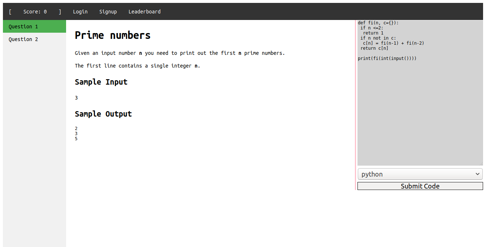
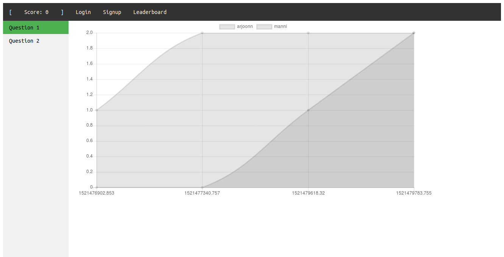

OpenJudge
=========

**Refactored!**

OpenJudge has been refactored to be faster and easier to set up! This
repository was about quick contests for small groups of 20-30 people. Somewhere
along the way, I faltered and it became bloated. It's back now in a form which
is fast and light.

Screenshots
----------




Usage
-----

First install MongoDB by following the instructions [in their docs](https://docs.mongodb.com/manual/tutorial/install-mongodb-on-ubuntu/)

```bash
sudo apt-get install python3-dev
pip install --user pipenv
pipenv install openjudge --python 3.5
pipenv shell

mkdir questions
cd questions

mkdir 1
cd 1

# Create these files
touch statement i0 o0 i1 o0

# go back to where the questions directory resides
cd ../../
```

To run openjudge two commands need to be issued.  `openjudge` and `openjudge --judge` in two separate terminals. The first is the interface and the second is the "judge".

[](https://asciinema.org/a/1kaLBpe57efO7FGKEc7dHLxb0)
