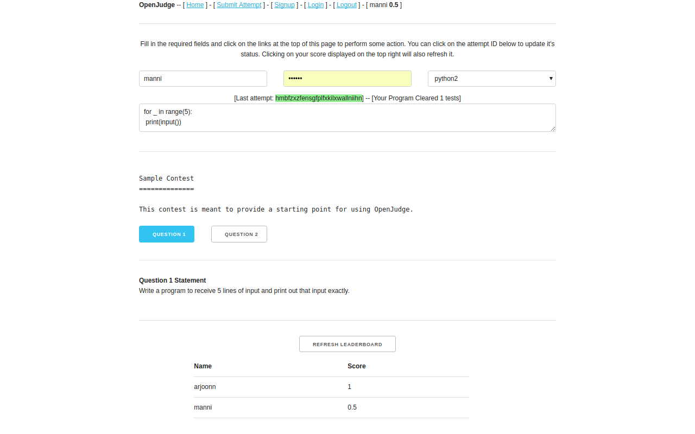

OpenJudge
=========

[](https://travis-ci.org/theSage21/openJudge)

**Refactored!**

OpenJudge has been refactored to be faster and easier to set up! This
repository was about quick contests for small groups of 20-30 people. Somewhere
along the way, I faltered and it became bloated. It's back now in a form which
is fast and light.


Usage
------

```bash
mkdir JanuaryContest
cd JanuaryContest
```

Now we create the contest's data. You can follow this general procedure


```bash
mkdir ContestData
cd ContestData
```

Now you can create the entire contest structure as a folder tree. The names of the folders carry meaning so please
don't change those. The folder `1` denotes the first question and so on. Within
each folder `i1` and `o1` denote the input and output for the first test case.
In this format you can create as many questions as needed and as many test
cases per question as you require.Ultimately this is the folder structure we require.

```
▾ ContestData/
  ▾ 1/
      i1
      o1
      statement
  ▾ 2/
      i1
      o1
      statement
    intro.txt
    wrappers.json
```

Now comes the part of installing openjudge to be used with your contest structure. First we create and activate a Python 3.5 virtual environment.

```bash
virtualenv -p python3 env
source env/bin/activate
```

Now we install openjudge. There are two ways of doing this and you can choose any.

```
pip install openjudge
pip install openjudge[analysis]
```

When installed with `analysis` you can go to `/analysis` to see simple analytic charts about the contest.

Language Support
----------------

- [x] G++
- [x] Python
- [x] C
- [x] Perl
- [x] Lua
- [x] Java


You can add your own languages in `wrappers.json`. Create a pull request!

Requirements
------------

- Python 3.5 `There is some subprocessing work which is only available 3.5 onwards`
- bottle.py ` This is the new website framework instead of Django`

Optional ones are:

- pandas `it is used for clean DataFrame management. Mostly keeping in mind future features`
- matplotlib `for plotting those graphs`

Detailed Installation
------------

First get python3.5 or above
```bash
sudo apt-get install python-virtualenv
sudo add-apt-repository ppa:fkrull/deadsnakes
sudo apt-get update
sudo apt-get install python3.5
```

Then make a directory to contain your entire contest. Nothing outside this directory is touched.
```bash
cd ~
mkdir temporary_directory
cd temporary_directory
```

Now set up openjudge in this directory

```bash
cd ~/temporary_directory
virtualenv -p python3.5 environment
source environment/bin/activate
pip install openjudge
```

To run an actual contest you need a directory called `ContestData` in this folder. Read below to see how to set that up. After that is set up all you need to do is run openjudge like this.

```bash
cd ~/temporary_directory
source environment/bin/activate
openjudge
```

Why?
----

Explaining to other people how this is supposed to work was a pain. The philosophy now is

```bash
$ pip install openjudge
$ openjudge
```

Scoring
-------

This is still the same. The score is determined by `(total - correct_valid) / total` attempts on a question by everyone at any given time. Only the first correct attempt by a person on a question counts for the `correct_valid`. Subsequent correct answers are considered wrong.

This leads to very few ties.


Todo
----

- [x] pip install
- [x] one command runnability
- [x] minimize dependencies
- [x] keep contest history
- [x] Login/Logout user system
- [x] Score Calculation
- [x] Leaderboard
- [x] Contest Analysis


Benchmarks
----------

On running `siege -c 100 -t 1M -b http://192.168.0.5:8080` we get the following
results. Keep in mind that it is is over local network with 100 concurrent users
hitting the site simultaneously without any delay. The default server can support up
to 50 people simultaneously without issues. More people than that will need some server like
`paste`. Here is the output of siege for those interested.

```
Transactions:                  53910 hits
Availability:                 100.00 %
Elapsed time:                  59.68 secs
Data transferred:             989.80 MB
Response time:                  0.06 secs
Transaction rate:             903.32 trans/sec
Throughput:                    16.59 MB/sec
Concurrency:                   50.21
Successful transactions:       53910
Failed transactions:               0
Longest transaction:           55.84
Shortest transaction:           0.00

```

Screenshot
----------


